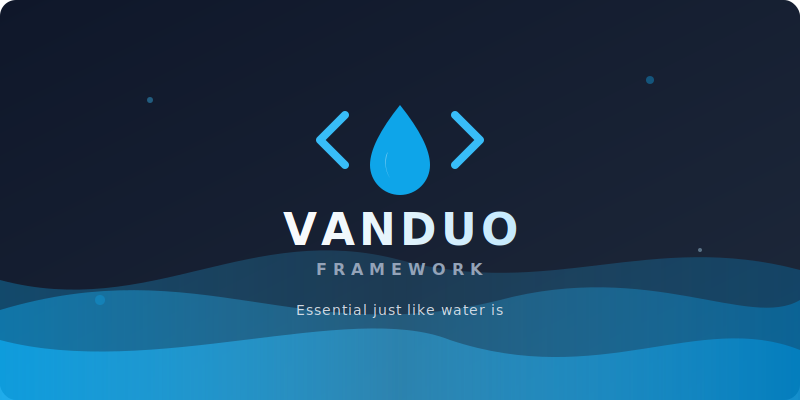

# Vanduo Framework v1.2.2

<p align="center">
  
</p>

<p align="center">
  <a href="https://www.npmjs.com/package/vanduo-framework"></a>
  <a href="https://github.com/Nostromo-618/vanduo-framework/actions/workflows/ci.yml"></a>
  <a href="https://github.com/Nostromo-618/vanduo-framework/blob/main/dist/vanduo.min.css"></a>
  <a href="https://github.com/Nostromo-618/vanduo-framework/blob/main/LICENSE"></a>
</p>

**Essential just like water is.** 

- **Pure HTML, CSS, JS** 
- **No third party dependencies**
- **Free and open source.**

## Overview

A lightweight, pure HTML/CSS/JS framework for designing beautiful interfaces. Zero runtime dependencies, no mandatory build tools, just clean and simple code.

[**Browse Full Documentation &rarr;**]([https://vanduo.dev/#docs](https://vanduo.dev/#docs) 

## Features

- 🎨 **Pure CSS/JS** - No libraries, no dependencies
- 🚀 **Lightweight** - Minimal file size, maximum performance
- 📱 **Responsive** - Mobile-first design approach
- 🎯 **Utility-First** - Flexible utility classes for rapid development
- 🧩 **Modular** - Import only what you need
- ♿ **Accessible** - Built with accessibility in mind (WCAG 2.1 AA)
- 🌙 **Dark Mode** - Automatic OS preference detection + manual toggle
- 🎛️ **Theme Customizer** - Real-time color, radius, font, and mode customization
- 🔍 **SEO-Ready** - Comprehensive meta tags, structured data, and sitemap

### The Vanduo Way
Stop wrapping everything in bloated container DOMs. Build beautiful, accessible UI components with clean, predictable utility classes:

```html
<!-- Raw HTML -->
<button>Click Me</button>

<!-- With Vanduo Framework -->
<button class="vd-btn vd-btn-primary vd-radius-full">
  <i class="ph ph-sparkle"></i> Click Me
</button>
```

---

## Quick Start

### Option 1: Package Manager (Recommended)

**We strongly recommend using [pnpm](https://pnpm.io/)** for installing Vanduo Framework. Vanduo is strictly configured with `.npmrc` security policies (such as blocking exotic sub-dependencies and strict peer enforcement) that work best with inside the pnpm ecosystem.

```bash
pnpm add vanduo-framework
```

*(Note: While `npm install vanduo-framework` and `yarn add vanduo-framework` will still technically work, they do not inherently enforce the same strict lockfile and isolated `node_modules` security guarantees that pnpm provides out-of-the-box).*

### Option 2: CDN (Fastest)

Load directly from jsDelivr — no download required:

```html
<!DOCTYPE html>
<html lang="en">
<head>
    <meta charset="UTF-8">
    <meta name="viewport" content="width=device-width, initial-scale=1.0">
    <title>My Website</title>
    <!-- Vanduo CSS via CDN -->
    <link rel="stylesheet" href="https://cdn.jsdelivr.net/gh/Nostromo-618/vanduo-framework@main/dist/vanduo.min.css">
</head>
<body>
    <!-- Your content here -->
    
    <!-- Vanduo JS via CDN -->
    <script src="https://cdn.jsdelivr.net/gh/Nostromo-618/vanduo-framework@main/dist/vanduo.min.js"></script>
    <script>Vanduo.init();</script>
</body>
</html>
```

**Pin to a specific version** (recommended for production):
```html
<link rel="stylesheet" href="https://cdn.jsdelivr.net/gh/Nostromo-618/vanduo-framework@v1.2.2/dist/vanduo.min.css">
<script src="https://cdn.jsdelivr.net/gh/Nostromo-618/vanduo-framework@v1.2.2/dist/vanduo.min.js"></script>
<script>Vanduo.init();</script>
```


### Option 3: Download

[**Download dist/ folder**](https://github.com/Nostromo-618/vanduo-framework/tree/main/dist) and include locally:

```html
<!DOCTYPE html>
<html lang="en">
<head>
    <meta charset="UTF-8">
    <meta name="viewport" content="width=device-width, initial-scale=1.0">
    <title>My Website</title>
    <link rel="stylesheet" href="dist/vanduo.min.css">
</head>
<body>
    <!-- Your content here -->
    
    <script src="dist/vanduo.min.js"></script>
    <script>Vanduo.init();</script>
</body>
</html>
```

The `dist/` folder is **self-contained** (CSS, JS, Fonts, Icons).

### Option 4: Source Files

For development or when you need more control, use the unminified source:

```html
<!DOCTYPE html>
<html lang="en">
<head>
    <meta charset="UTF-8">
    <meta name="viewport" content="width=device-width, initial-scale=1.0">
    <title>My Website</title>
    <link rel="stylesheet" href="css/vanduo.css">
</head>
<body>
    <!-- Your content here -->
    
    <script src="js/vanduo.js"></script>
    <script>Vanduo.init();</script>
</body>
</html>
```

---

## LLM Access

This project includes an [`llms.txt`](llms.txt) file — a structured markdown summary designed for AI assistants and LLM-powered code editors. It provides quick access to framework documentation, component references, and usage patterns.

---

## Release Assets (Maintainers)

Use the hardened upload script to attach only approved bundle artifacts from `dist/`:

```bash
pnpm run release:assets -- v1.2.2
```

Notes:
- If tag is omitted, it defaults to `v` + version from `package.json`.
- Use `--dry-run` to preview files without uploading.

---

## Documentation

Comprehensive documentation for all components, utilities, and customization options is available at vanduo.dev.

[**View Documentation**]([https://vanduo.dev/#docs](https://vanduo.dev/#docs)

### Key Capabilities

*   **Dark Mode**: Works automatically with system preferences. Can be forced via `data-theme="dark"` on `<html>`.
*   **Theme Customizer**: Built-in runtime tool to change colors, fonts, and radius.
*   **Modular Imports**: Import only specific components (e.g., `css/components/buttons.css`) to keep your site lean.
*   **Icons**: Includes [Phosphor Icons](https://phosphoricons.com) (Regular + Fill weights bundled).

---

## Project Structure

```
vanduo-framework/
├── dist/                  # Production ready files (minified)
├── css/
│   ├── vanduo.css         # Main framework file (imports all)
│   ├── core/              # Foundation (colors, typography, grid)
│   ├── components/        # UI components (buttons, cards, etc)
│   ├── utilities/         # Utility classes
│   └── effects/           # Visual effects
├── js/
│   ├── vanduo.js          # Main entry point
│   └── components/        # Component logic
├── icons/                 # Phosphor Icons
├── fonts/                 # Web fonts
└── tests/                 # Framework test suite
```

## Browser Support

- Chrome (last 2 versions)
- Firefox (last 2 versions)
- Safari (last 2 versions)
- Edge (last 2 versions)

## License

MIT License - see [LICENSE](LICENSE) file for details.

## Credits

- **Color System**: [Open Color](https://yeun.github.io/open-color/) by Heeyeun Jeong (MIT License)
- **Icons**: [Phosphor Icons](https://phosphoricons.com) (MIT License)

---
Vanduo Framework - Built with ❤️ for the web.
